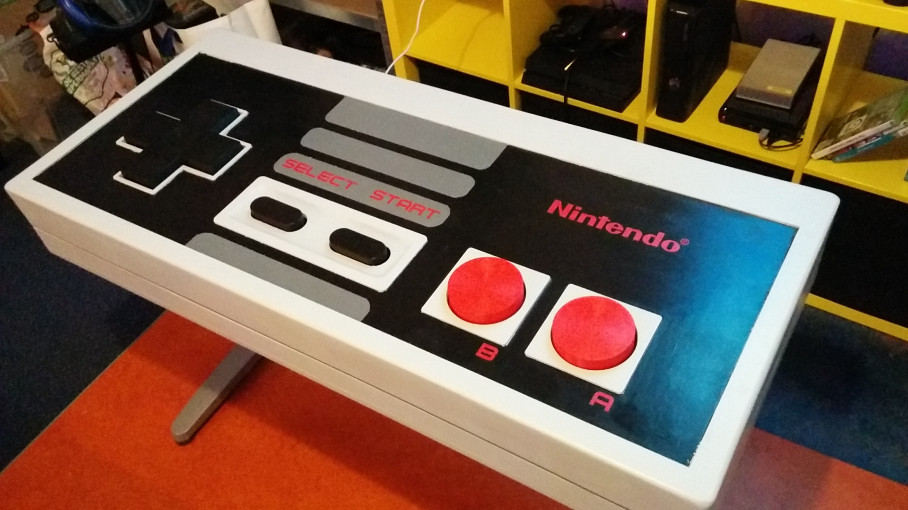

# Giant NES controller

This repository contains the design files for our giant NES controller.

# Firmware
The firmware16 and firmware328 folders contain the firmware used to make an Arduino Uno into a gamepad.

License: CC0

Author: Renze Nicolai

TkkrLab hackerspace, Enschede 2019
